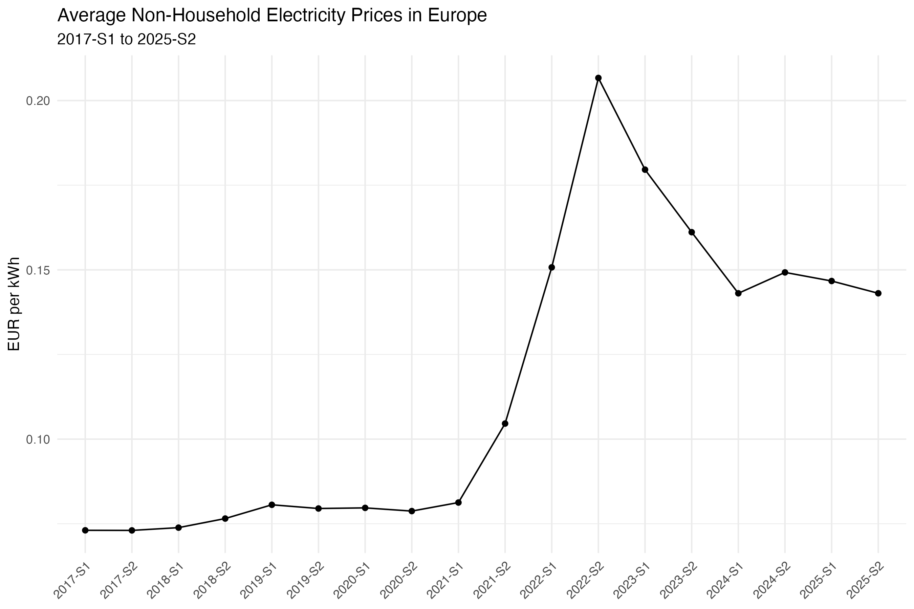
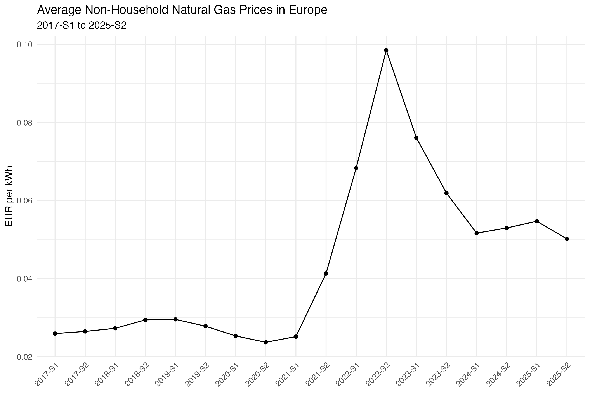
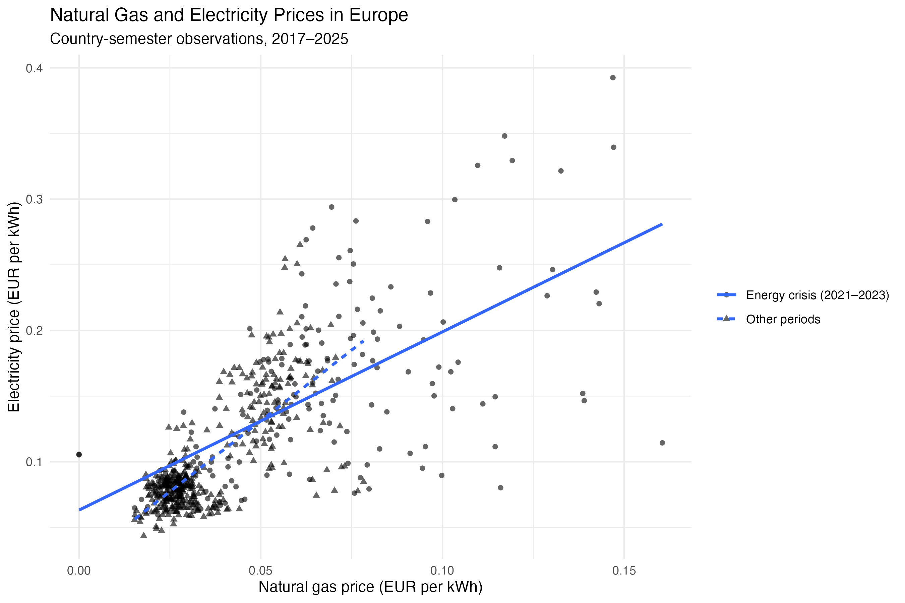
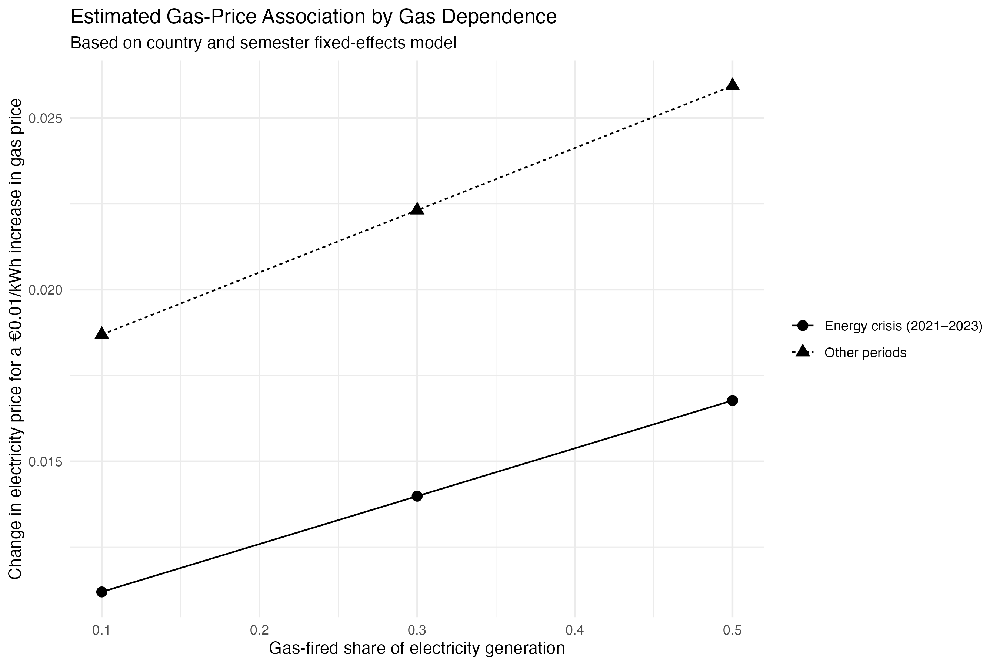

# European Electricity Prices and Energy Mix

An end-to-end analysis of European electricity prices, energy markets, and the 2021–2023 energy crisis.

## Tools

- **R** — data inspection, exploratory analysis, visualization, and regression
- **SQL** — preprocessing and analytical panel construction
- **DuckDB** — local analytical database
- **Git & GitHub** — version control and project management

## Research questions

1. How did non-household electricity prices evolve across European countries from 2017 to 2025, particularly during the energy crisis?

2. How are natural gas prices and gas-fired electricity generation dependence associated with electricity prices across European countries?

3. Were countries with greater reliance on natural gas-fired electricity generation more exposed to electricity price increases during the 2021–2023 energy crisis?

## Data

All data are obtained from Eurostat.

### Electricity Prices

- Dataset: `nrg_pc_205`
- Description: Electricity prices for non-household consumers
- Frequency: Bi-annual
- Coverage: 2007-S1 to 2025-S2
- Main price measure:
  - Consumption band: `MWH500-1999`
  - Taxes: `X_TAX`
  - Currency: EUR
  - Unit: EUR per kWh

### Natural Gas Prices

- Dataset: `nrg_pc_203`
- Description: Natural gas prices for non-household consumers
- Frequency: Bi-annual
- Coverage: 2007-S1 to 2025-S2
- Main price measure:
  - Consumption band: `GJ10000-99999`
  - Taxes: `X_TAX`
  - Currency: EUR
  - Unit: EUR per kWh

### Electricity Generation by Fuel

- Dataset: `nrg_cb_pem`
- Description: Net electricity generation by type of fuel
- Frequency: Monthly
- Coverage: 2008-01 to 2026-06

The detailed fuel categories used in the main analysis are available from 2017 onwards.

Main categories include:

- Natural gas
- Coal and manufactured gases
- Renewables and biofuels
- Nuclear and other fuels
- Oil and petroleum products

Monthly generation data are aggregated into semesters:

- January–June → S1
- July–December → S2

The final analytical unit is:

`country × semester`

---

## Methodology

### 1. Data Inspection

The three Eurostat datasets were first inspected in R to check:

- variable definitions
- consumption bands
- tax treatment
- units
- missing values
- country coverage
- time coverage
- duplicate observations
- fuel classification structure

### 2. SQL Preprocessing

The SQL pipeline:

1. filters the electricity price measure
2. filters the natural gas price measure
3. aggregates monthly generation into semester totals
4. constructs fuel-generation shares
5. joins all sources into a final analytical panel

### 3. Exploratory Data Analysis

EDA in R focuses on:

- electricity price trends
- natural gas price trends
- gas price–electricity price correlations
- gas-fired generation dependence
- differences between the 2021–2023 crisis period and other years

### 4. Regression Analysis

The main regression specifications include:

- pooled OLS
- gas-price × gas-generation-share interaction
- country fixed effects
- country and semester fixed effects
- crisis-period interaction models

Standard errors are clustered at the country level.

The main model takes the form:

$$ ElectricityPrice_{it} = \beta_1 GasPrice_{it} + \beta_2 GasShare_{it} + \beta_3 \left( GasPrice_{it} \times GasShare_{it} \right) + \alpha_i + \lambda_t + \varepsilon_{it} $$

where:

- $\alpha_i$ represents country fixed effects
- $\lambda_t$ represents semester fixed effects

---

## Key Findings

- Higher natural gas prices are strongly associated with higher electricity prices.
- Gas dependence may amplify this relationship, but the evidence is not fully robust across fixed-effects models.
- Results remain broadly similar in the balanced-panel robustness check.

---

## Results

### Electricity Price Trend

European non-household electricity prices were relatively stable before 2021, increased sharply during the energy crisis, and remained above pre-crisis levels afterwards.

### Natural Gas Price Trend

Natural gas prices show a similar pattern, with a sharp increase around the crisis period and a subsequent decline.

### Natural Gas and Electricity Prices

Natural gas prices and electricity prices show a strong positive relationship across country-semester observations.

### Gas Dependence and Estimated Gas-Price Association

The estimated gas-price association tends to be larger at higher levels of gas-fired generation dependence, although the interaction is not statistically robust across all model specifications.

---

## Regression Results

The full regression table is available [here](output/tables/regression_results.html).

The fixed-effects models show a robust positive association between natural gas prices and electricity prices. Evidence that gas-fired generation dependence strengthens this relationship is weaker, and the crisis-period three-way interaction is not statistically significant.

## Robustness Check

A balanced-panel robustness check restricts the sample to countries observed in all 18 semesters between 2017-S1 and 2025-S2.

The main qualitative findings remain similar:

- the gas-price coefficient remains positive and statistically significant
- the gas-price × gas-share interaction remains positive
- the crisis-related three-way interaction remains statistically insignificant

---

## Limitations

This project is observational and focuses on statistical associations rather than causal effects.

Important limitations include:

- differences in national electricity market design
- government interventions during the energy crisis
- long-term energy contracts
- transmission constraints
- incomplete availability of detailed generation data before 2017
- potential differences in industrial consumer composition across countries

The fixed-effects specifications reduce some sources of unobserved heterogeneity, but the results should not be interpreted as causal estimates.